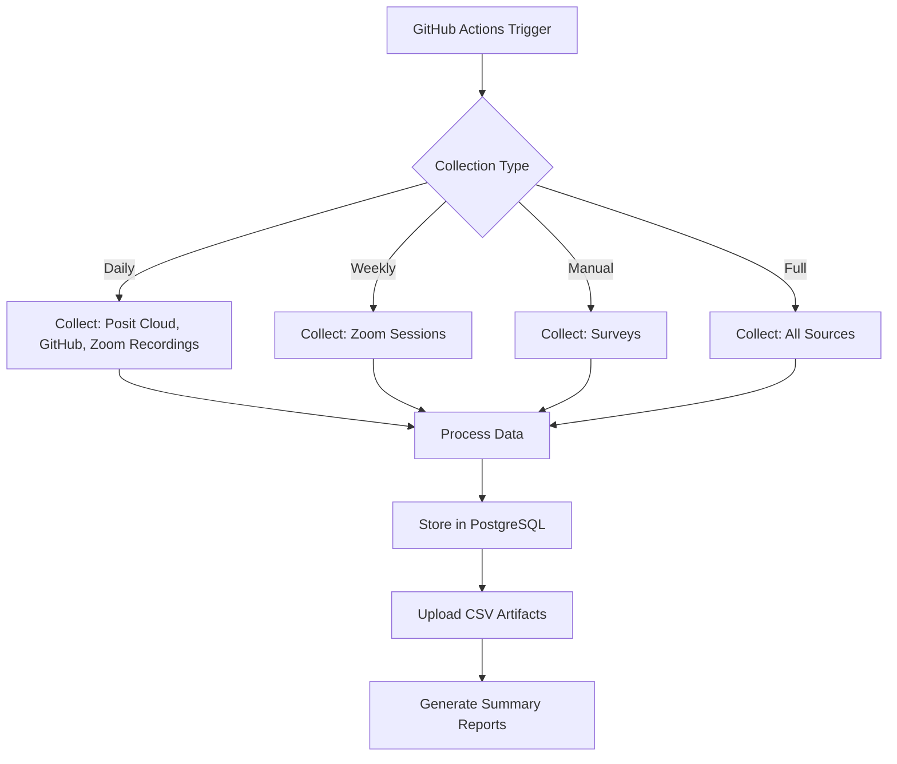

# Data Collection Schedule

This document outlines the automated data collection schedule implemented via GitHub Actions.

## Collection Schedule

### Daily Collection (2 AM UTC)
**Sources**: `posit_cloud`, `github_commits`, `zoom_recordings`

- **Posit Cloud Usage**: Workspace activity, session data, resource utilization
- **GitHub Commits**: Repository activity from course organization
- **Zoom Recordings**: Video viewing statistics and engagement metrics

**Rationale**: These sources generate data continuously and benefit from daily collection to capture detailed activity patterns.

### Weekly Collection (Fridays 3 AM UTC)  
**Sources**: `zoom_sessions`

- **Zoom Live Sessions**: Meeting attendance, participation duration, session metadata

**Rationale**: Live sessions typically occur on a weekly schedule, so Friday collection captures the week's session data.

### Manual Collection (On Demand)
**Sources**: `pre_survey`, `post_survey`

- **Pre-Course Survey**: Participant demographics, expectations, baseline knowledge
- **Post-Course Survey**: Learning outcomes, satisfaction, feedback

**Rationale**: Surveys are administered at specific course milestones and don't require continuous collection.

## Collection Types

### 1. Daily (`daily`)
```yaml
schedule: '0 2 * * *'
sources: ["posit_cloud", "github_commits", "zoom_recordings"]
```

### 2. Weekly (`weekly`)
```yaml
schedule: '0 3 * * 5'  # Fridays
sources: ["zoom_sessions"]
```

### 3. Manual Surveys (`manual_surveys`)
```yaml
trigger: workflow_dispatch
sources: ["pre_survey", "post_survey"]
```

### 4. Full Collection (`full`)
```yaml
trigger: workflow_dispatch
sources: "all"
```

## Data Processing Flow



## Storage Strategy

### Database Storage
- **Method**: Upsert (insert or update existing records)
- **Benefits**: Prevents duplicates, allows reprocessing
- **Tables**: Dedicated table for each data source

### Artifact Storage
- **Format**: CSV files for each data source
- **Retention**: 30 days on GitHub
- **Purpose**: Backup, manual analysis, debugging

## Monitoring

### Workflow Status
- **Location**: GitHub Actions tab
- **Notifications**: Email on workflow failures
- **Logs**: Detailed execution logs for debugging

### Data Quality
- **Collection Summary**: Records collected per source
- **Storage Summary**: Records stored successfully
- **Error Reporting**: Failed collections and reasons

## Configuration

### Time Zones
- **UTC**: All schedules use UTC time
- **Conversion**: Adjust for local time zones as needed
- **DST**: UTC avoids daylight saving time issues

### Frequency Adjustment
To modify collection frequency, update the cron expressions in `.github/workflows/data-collection.yml`:

```yaml
schedule:
  # Daily at different time
  - cron: '0 6 * * *'  # 6 AM UTC instead of 2 AM
  
  # Different day of week
  - cron: '0 3 * * 1'  # Mondays instead of Fridays
  
  # Multiple times per day
  - cron: '0 2,14 * * *'  # 2 AM and 2 PM UTC
```

## Troubleshooting

### Common Issues

1. **API Rate Limits**
   - **Solution**: Add delays between requests
   - **Prevention**: Stagger collection times

2. **Credential Expiration**
   - **Solution**: Update GitHub secrets
   - **Prevention**: Set up credential rotation alerts

3. **Database Connection**
   - **Solution**: Check database availability
   - **Prevention**: Use connection retry logic

4. **Large Data Volumes**
   - **Solution**: Implement pagination limits
   - **Prevention**: Monitor artifact sizes

### Manual Intervention

When automated collection fails:

1. **Check workflow logs** for specific error messages
2. **Verify secrets** are correctly configured
3. **Test APIs manually** to confirm service availability
4. **Run manual collection** to recover missed data

### Data Recovery

For missed collections:

```r
# Collect specific date range manually
source("main.R")

# Modify collection functions to accept date parameters
# Then run targeted collection for missed periods
```

## Security Considerations

### Secrets Management
- **Rotation**: Regularly update API keys and tokens
- **Scope**: Use minimal required permissions
- **Access**: Limit repository access to authorized users

### Data Protection
- **Encryption**: Database connections use TLS
- **Access Control**: Repository-level access controls
- **Retention**: Automatic artifact cleanup after 30 days

## Performance Optimization

### Resource Usage
- **Memory**: Monitor R process memory usage
- **CPU**: Optimize data processing pipelines
- **Storage**: Compress large datasets

### Execution Time
- **Parallel Processing**: Collect from multiple sources concurrently
- **Caching**: Cache API responses when appropriate
- **Optimization**: Profile and optimize slow operations

## Future Enhancements

### Potential Improvements
- **Real-time Collection**: Webhook-based immediate data collection
- **Data Validation**: Enhanced data quality checks
- **Alerting**: Advanced monitoring and alerting
- **Analytics**: Built-in data analysis and reporting
- **Scaling**: Support for multiple course instances